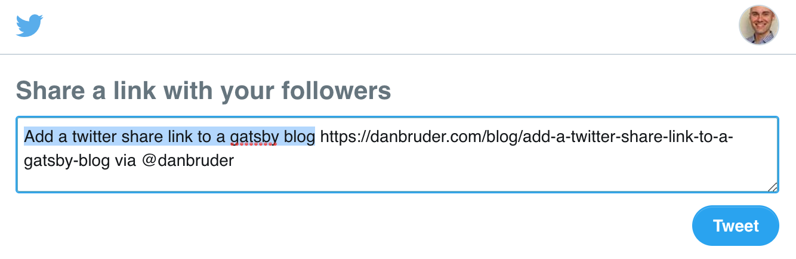

To add a twitter share link, you can use the link format outlined here: [https://developer.twitter.com/en/docs/twitter-for-websites/tweet-button/overview.html](https://developer.twitter.com/en/docs/twitter-for-websites/tweet-button/overview.html). 

For me, this meant formatting the link with the url, title, and my twitter handle:

```js
// Shortened for brevity
const BlogTemplate({data}) => (
  <a href={formatShareLink(data)}>Tweet this post</a>
)

const formatShareLink = data => {
  let slug = get(data, 'blog.slug')
  let url = `https://danbruder.com/blog/${slug}`
  let text = get(data, 'blog.title')
  let via = `danbruder`
  return `https://twitter.com/intent/tweet?url=${url}&text=${text}&via=${via}`
}

export const pageQuery = graphql`
  query BlogQuery($slug: String) {
    blog: contentfulPost(slug: { eq: $slug }) {
      title
      slug
    }
  }
}
```

Make sure your `pageQuery` includes the needed data (title, slug): 

```js
// Shortened for brevity
const BlogTemplate({data}) => (
  <a href={formatShareLink(data)}>Tweet this post</a>
)

const formatShareLink = data => {
  let slug = get(data, 'blog.slug')
  let url = `https://danbruder.com/blog/${slug}`
  let text = get(data, 'blog.title')
  let via = `danbruder`
  return `https://twitter.com/intent/tweet?url=${url}&text=${text}&via=${via}`
}

export const pageQuery = graphql`
  query BlogQuery($slug: String) {
    blog: contentfulPost(slug: { eq: $slug }) {
      title
      slug
    }
  }
}
```


