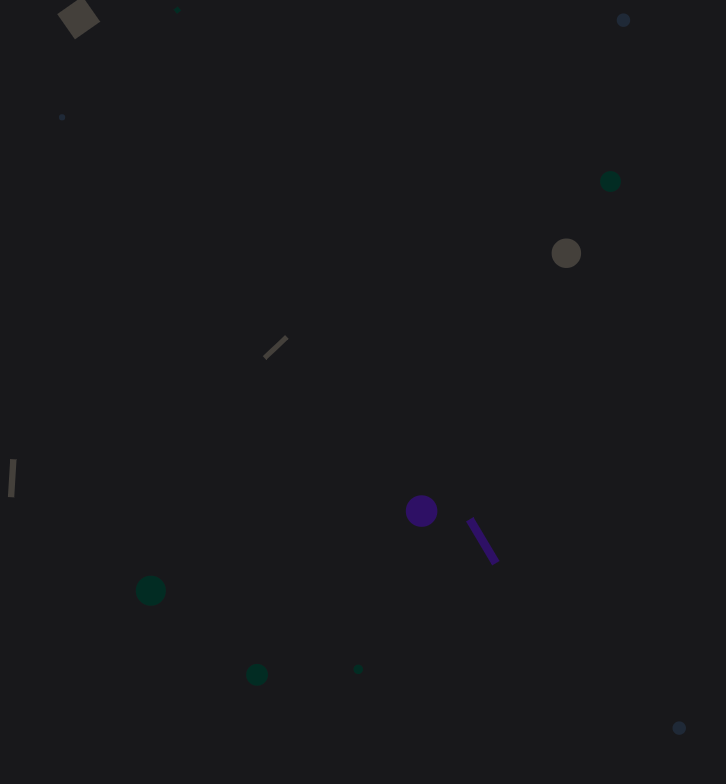

The [CSS Painting API](https://developer.mozilla.org/en-US/docs/Web/API/CSS_Painting_API) allows you to create custom values for `paint()` which can be used in `background-image` to set custom backgrounds on an element.

To create a dynamic background image, the you need the following HTML, CSS, and JS:

```css
.painted { 
  background-image: paint(myPaintedBackground);
}
```

```html
<body class="painted">
  <!-- content -->
</body>
```

```js
// main.js
CSS.paintWorklet.addModule('/paintWorklet.js');
```

```js
// paintWorklet.js
registerPaint('myPaintedBackground', class {
    paint(ctx, geom, properties) {
      // pattern
    }
};
```

With the basics in place, next step is to fill in the `paint` method with the logic to draw the pattern. This has a [canvas](https://developer.mozilla.org/en-US/docs/Web/API/Canvas_API) like API and you can draw shapes, lines, etc.

To create the pattern you see on this site, I used the following code. I didn't get it on my first try, it took some tweaking to get it to look just right.

```js
// paintWorklet.js
registerPaint('myPaintedBackground', class {
  paint(ctx, geom, properties) {
    const shapes = ['circle', 'rectangle', 'line'];

    // Subtle color palette
    const colors = ['#2e1065', '#022c22', '#1f2937', '#44403c']; 

    // Make the number of shapes relative to the height of the element
    const maxShapes = geom.height / 3;

    for (let i = 0; i < maxShapes; i++) {
      // Get random color, shape, position, size, etc
      const color = colors[Math.floor(Math.random() * colors.length)];
      const shape = shapes[Math.floor(Math.random() * shapes.length)];
      const x = Math.random() * geom.width;
      const y = Math.random() * geom.height;
      const size = Math.random() * 15 + 1; 
      const rotation = Math.random() * 180 + 1; 
      var direction = Math.random() < 0.5 ? -1 : 1;

      // Draw the shape
      ctx.fillStyle = color;
      ctx.beginPath();

      if (shape === 'circle') {
        // Circle
        ctx.arc(x, y, size / 2, 0, 2 * Math.PI);
      } else if (shape == 'rectangle') { 
        // Rotated rectangle
        ctx.rotate((rotation * direction * Math.PI) / 180);
        ctx.rect(x, y, size, size);
        ctx.setTransform(1, 0, 0, 1, 0, 0);
      } else if (shape == 'line') { 
        // Rotated line
        ctx.rotate((rotation * direction * Math.PI) / 180);
        ctx.rect(x, y, size / 3, size * 2);
        ctx.setTransform(1, 0, 0, 1, 0, 0);
      }

      // Close out the shape
      ctx.fill();
    }
  }
};
```

Turned out pretty good!



Except on safari.

# Safari support

CSS Painting API is experimental and [_does not work_ in Safari](https://caniuse.com/css-paint-api). But I want mobile viewers to see this fancy background too!

To get around this, I used the same JS class to generate the pattern, pulled the image out using `toDataUrl`, then set that as the background: 

```js 
if ("paintWorklet" in CSS) {
  CSS.paintWorklet.addModule("/paintWorklet.js");
} else {
  // Paint worklet not supported, use canvas directly
  let canvas = document.createElement('canvas');
  canvas.width = window.innerWidth;
  canvas.height = window.innerHeight;

  let ctx = canvas.getContext('2d');
  let cp = new CirclesPainter;
  cp.paint(ctx, {width: canvas.width, height: canvas.height});
  let url = canvas.toDataURL();
  document.body.style.backgroundImage = `url(${url})`;
}
```

This means I needed to load the `paintWorklet.js` outside of using the `CSS.paintWorklet.addModule` method. I did this by adding the script tag to the HTML:

```html
<script src="paintWorklet.js"></script>
```

# Wrapping up 

In the end, the full code looks like this:

```html
<!-- index.html -->
<head>
  <link rel="stylesheet" href="main.css" />
  <script src="paintWorklet.js"></script>
  <script src="main.js"></script>
</head>

<body class="painted">
  <!-- content -->
</body>
```

```css
/* main.css */
.painted { 
  background-image: paint(myPaintedBackground);
}
```

```js
// main.js
document.addEventListener('DOMContentLoaded', function(){
  if ("paintWorklet" in CSS) {
    CSS.paintWorklet.addModule("/paintWorklet.js");
  } else {
    let canvas = document.createElement('canvas');
    canvas.width = window.innerWidth;
    canvas.height = window.innerHeight;

    let ctx = canvas.getContext('2d');
    let p = new MyPainter();                                                                                                                  
    p.paint(ctx, {width: canvas.width, height: canvas.height});
    let url = canvas.toDataURL();                                                                                                                 
    let el = document.body;
    el.style.backgroundImage = `url(${url})`;
  }
}, false);
```

```js
// paintWorklet.js
class MyPainter {
  paint(ctx, geom) {
    const colors = ["#2e1065", "#022c22", "#1f2937", "#44403c"]; // Subtle color palette
    const shapes = ["circle", "rectangle", "line"];
    const maxShapes = geom.height / 3;

    for (let i = 0; i < maxShapes; i++) {
      const color = colors[Math.floor(Math.random() * colors.length)];
      const shape = shapes[Math.floor(Math.random() * shapes.length)];
      const x = Math.random() * geom.width;
      const y = Math.random() * geom.height;
      const size = Math.random() * 15 + 1;
      const rotation = Math.random() * 180 + 1;
      var direction = Math.random() < 0.5 ? -1 : 1;

      ctx.fillStyle = color;
      ctx.beginPath();

      if (shape === "circle") {
        ctx.arc(x, y, size / 2, 0, 2 * Math.PI);
      } else if (shape == "rectangle") {
        // rectangle
        ctx.rotate((rotation * direction * Math.PI) / 180);
        ctx.rect(x, y, size, size);
        ctx.setTransform(1, 0, 0, 1, 0, 0);
      } else if (shape == "line") {
        // rectangle
        ctx.rotate((rotation * direction * Math.PI) / 180);
        ctx.rect(x, y, size / 3, size * 2);
        ctx.setTransform(1, 0, 0, 1, 0, 0);
      }

      ctx.fill();
    }
  }
}

if (typeof registerPaint === "function") {
  registerPaint("myPaintedBackground", MyPainter);
}
```
