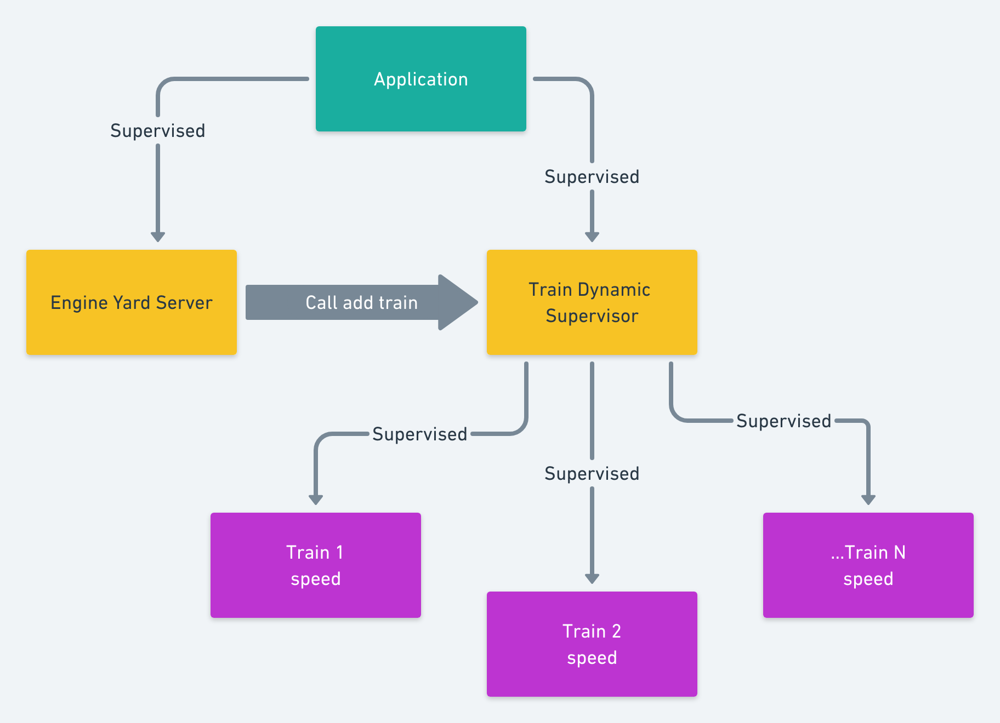

Here's an example of a dynamic supervision tree in Elixir/OTP. Say we have an application that tracks trains in a fleet. We have the following topology: 



Since on a given day different trains will be active, we want to be able to dynamically add and remove processes for them to the supervision tree. 

```elixir
defmodule Yard.Server do
  use GenServer
  @moduledoc false

  def init(args) do
    {:ok, args}
  end

  def start_link(opts) do
    GenServer.start_link(__MODULE__, %{}, name: __MODULE__)
  end

  # -----------------------------------------------------
  # Client
  # -----------------------------------------------------
  def add_train(args) do
    GenServer.call(__MODULE__, {:add_train, args})
  end

  # -----------------------------------------------------
  # Server
  # -----------------------------------------------------
  def handle_call({:add_train, args}, _from, state) do
    start_status = Yard.TrainSupervisor.add_train(args)
    {:reply, start_status, state}
  end
end

defmodule Yard.TrainSupervisor do
  use DynamicSupervisor

  def start_link(_arg) do
    DynamicSupervisor.start_link(__MODULE__, :ok, name: __MODULE__)
  end

  def init(:ok) do
    DynamicSupervisor.init(strategy: :one_for_one)
  end

  def add_train(id) do
    child_spec = {Yard.Train, id}
    DynamicSupervisor.start_child(__MODULE__, child_spec)
  end

  def remove_train(pid) do
    DynamicSupervisor.terminate_child(__MODULE__, pid)
  end
end

defmodule Yard.Train do
  use GenServer

  def init(id) do
    {:ok,
     %{
       id: id,
       speed: nil
     }}
  end

  def start_link([], id) do
    start_link(id)
  end

  def start_link(id) do
    GenServer.start_link(__MODULE__, id, name: {:global, "train:#{id}"})
  end

  # -----------------------------------------------------
  # Client
  # -----------------------------------------------------
  def get(pid) do
    GenServer.call(pid, :get)
  end

  def update_speed(pid, speed) do
    GenServer.cast(pid, {:update_speed, speed})
  end

  # -----------------------------------------------------
  # Server
  # -----------------------------------------------------
  def handle_call(:get, _from, state) do
    {:reply, {:ok, state}, state}
  end

  def handle_cast({:update_speed, speed}, state) do
    new_state = Map.merge(state, %{speed: speed})
    {:noreply, new_state}
  end
end
```

Next, we add the Yard server and the Train Supervisor to the application supervision tree: 

```elixir
defmodule Yard.Application do
  @moduledoc false

  use Application

  def start(_type, _args) do
    children = [
      Yard.Server,
      Yard.TrainSupervisor
    ]

    opts = [strategy: :one_for_one, name: Engine.Supervisor]
    Supervisor.start_link(children, opts)
  end
end
```

Now when we fire up `iex -S mix` we can add trains and update their speeds: 

```elixir
iex> {:ok, pid} = Yard.Server.add_train("A13")
PID<0.2342.0>

iex> Yard.Train.get(pid)
{:ok, %{id: "A13", speed: nil}}

iex> Yard.Train.update_speed(pid, 65)
:ok

iex> Yard.Train.get(pid)
{:ok, %{id: "A13", speed: 65}}
```

If a train process crashes, it will be restarted by the `TrainSupervisor`. In another post, I'm going to look at how to maintain state across crashes. 


