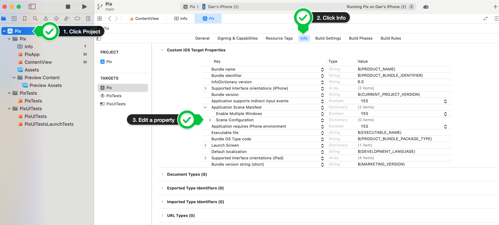

I created a fresh SwiftUI project that needs access to the camera, but when I run it on my device, it crashes! 

Xcode says the problem is that I have not added `NSCameraUsageDescription` to `Info.plist`. You need to tell Apple what privacy features this app should have access to. This is done by specifying them as values in the `Info.plist` file.

However, I didn't have one - how do I add it? 

I followed the instructions in [this blog post](https://useyourloaf.com/blog/xcode-13-missing-info.plist/).



1. Click on the top level project
2. Click on the 'Info' tab
3. Edit a property in the configuration settings. I chose to remove then re-add `Scene Configuratoin` under `Application Scene Manifest`
4. The `Info.plist` file appears! 

With the empty `Info.plist` file open, I added the necessary privacy settings: 

```xml
<?xml version="1.0" encoding="UTF-8"?>
<!DOCTYPE plist PUBLIC "-//Apple//DTD PLIST 1.0//EN" "http://www.apple.com/DTDs/PropertyList-1.0.dtd">
<plist version="1.0">
<dict>
	<key>NSCameraUsageDescription</key>
	<string>Access camera</string>
	<key>NSPhotoLibraryUsageDescription</key>
	<string>Library</string>
</dict>
</plist>
```

Now I can take photos in my app!

Seems like it should have been easier than this...
